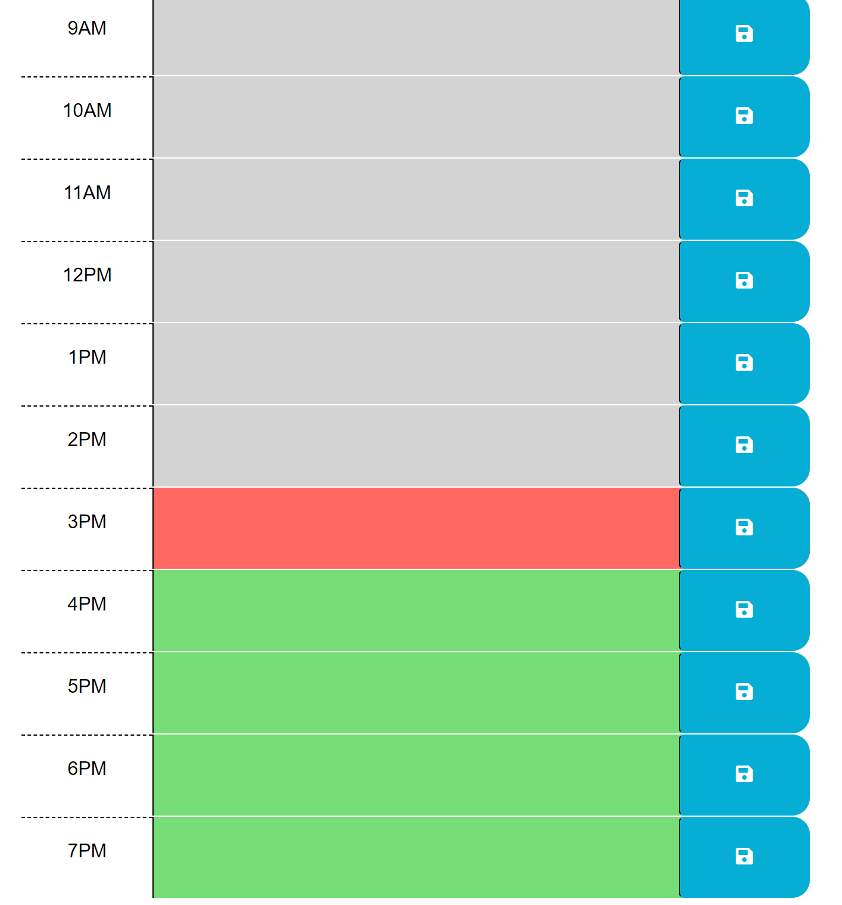

# Work Day Scheduler

## Description
This Work Day Scheduler application will help an employee or anyone keep track of the tasks that need to be completed!

## Usage
When the application is loaded up, the user will see a list of hours within the day that is listed at the top. The current hour will be red, hours that are apart of the future will be green, and the hours that have already passed will be gray. When the user wants to write a task down, they will simply go to the text area within the hour they would like the task to be done. Once that task is written, the user is able to click the save button to have their task saved in case of any refreshes or leaves.

## Screenshot
